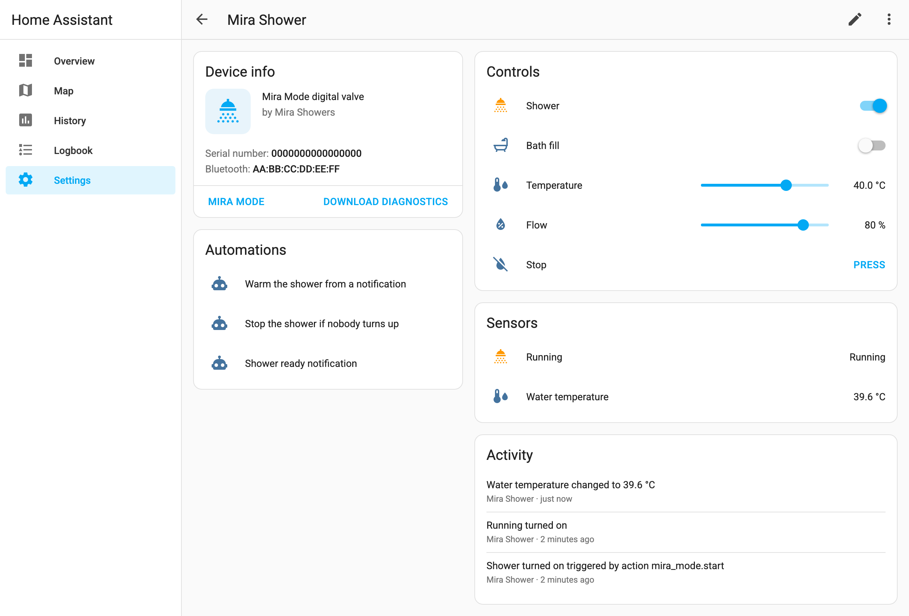

# Mira Mode for Home Assistant

[](https://github.com/HaydenGriffin/ha-mira-mode/actions/workflows/validate.yml)
[](https://hacs.xyz/docs/faq/custom_repositories)
[](LICENSE)

<!--
  Hero photo placeholder. Add a photo of the Mira Mode controller
  (wireless remote / front panel) as docs/images/hero.jpg, then uncomment:
  <p align="center"></p>
-->

Local control of **Mira Mode digital showers** from Home Assistant over
Bluetooth LE. You can start and stop each outlet, set the temperature and
flow, and watch the water warm up. It works with a local Bluetooth adapter
or an ESPHome-style Bluetooth proxy, needs no cloud, and you don't have to
leave the Mira app running anywhere.

It's the only Home Assistant integration for Mira Mode valves. It is built
on the protocol work of
[ryan-shaw/mira-mode-control](https://github.com/ryan-shaw/mira-mode-control).

<p align="center">
  
</p>

> [!WARNING]
> **This controls real hot water.** Read the [safety notes](#safety) before
> you automate anything. Home Assistant is not a safety system, and nothing
> here replaces the valve's own temperature limit or your plumber's
> thermostatic protection.

## Contents

- [Features](#features)
- [Supported hardware](#supported-hardware)
- [Installation](#installation)
- [Pairing and setup](#pairing-and-setup)
- [Entities](#entities)
- [Actions](#actions)
- [Automation examples](#automation-examples)
- [How it talks to the valve](#how-it-talks-to-the-valve)
- [Troubleshooting](#troubleshooting)
- [Safety](#safety)
- [Development](#development)
- [Credits](#credits)

## Features

- **Bluetooth discovery.** Valves within range of any connectable adapter or
  proxy show up under *Settings → Devices & services*.
- **Guided pairing.** The setup flow bonds with the valve while it is in
  pairing mode, or uses a bond the adapter already has.
- **Per-outlet switches**, labelled to match your plumbing (Shower, Bath fill,
  Handset and so on). Outlets your unit doesn't have can be hidden.
- **Temperature and flow controls.** Changes apply live while the valve is
  running. While idle they become the settings for the next start. If you
  change the temperature on the dial or in the Mira app, Home Assistant picks
  it up.
- **A `mira_mode.start` action** that sets the temperature and flow and starts
  an outlet in one step, built for automations and notification buttons.
- **Commands are confirmed.** Every command must be acknowledged by the valve
  and then read back as done, or the action raises an error. Silence never
  counts as success.
- Built-in limits of **30-45 °C**, a **Stop** button that stays available
  even when a poll fails, **diagnostics** download, translations, and
  re-pairing through *Reconfigure*.

## Supported hardware

| Valve | Status |
| --- | --- |
| Current-generation Mira Mode valves (they advertise the BLE service `267f0001-eb15-43f5-94c3-67d2221188f7`) | Supported |
| Older Mira Mode valves (they advertise `bccb0001-ca66-11e5-88a4-0002a5d5c51b` and pair by client id/slot) | Not supported. Discovery recognises them and stops. |

Development and live testing used a current-generation dual-outlet valve.
Status reads and remote start and stop were verified on it through a
Bluetooth proxy. Other valves in the current range should work, but only the
outlets your unit actually has will do anything.

**Bluetooth:** you need a connectable adapter or proxy that can reach the
valve and that can hold a **bond** with it. For example:

- the host's own adapter (BlueZ), if it is close enough
- an ESP32 running ESPHome with `bluetooth_proxy: active: true`
- any other active proxy that supports pairing

**Home Assistant:** 2025.10 or newer.

## Installation

### HACS (recommended)

1. In HACS, open the menu (⋮), then **Custom repositories**.
2. Add `https://github.com/HaydenGriffin/ha-mira-mode` with type
   **Integration**.
3. Search for **Mira Mode**, install it, and restart Home Assistant.

### Manual

1. Copy `custom_components/mira_mode` into your Home Assistant
   `config/custom_components/` folder.
2. Restart Home Assistant.

## Pairing and setup

The valve only talks over a **bonded** Bluetooth connection. It also only
accepts **one connection at a time**. Most setup problems come from one of
these two facts.

1. **Close the Mira app** on every phone and tablet near the valve. If the
   app is connected, Home Assistant can't connect.
2. In Home Assistant, go to **Settings → Devices & services**. Either accept
   the discovered *Mira Mode* device, or select **Add integration → Mira Mode**
   and pick the valve (or type its Bluetooth address).
3. Choose **Pair now**.
4. Put the valve in pairing mode. Press and hold the button on the front of
   the controller for about 5 seconds, until it flashes. On a dial model, go
   to *Menu → Settings → Connect*.
5. Select **Submit** within about 30 seconds. Home Assistant bonds, reads the
   valve's name, serial number and state, and creates the device. **No water
   runs during setup.**
6. Optional: open **Configure** on the integration and give each outlet a
   label. Clear a label to hide an outlet your unit doesn't have. The valve's
   presets in the Mira app show which outlet feeds what.

### The bond lives on the adapter, not on Home Assistant

The bond is stored by **the specific adapter or proxy that made it**.
Home Assistant connects through whichever connectable adapter has the best
signal and a free connection slot, and you can't pin it to one. This has some
consequences:

- A bond created on a different adapter, proxy or phone **does not carry
  over**.
- If you have several proxies in range of the valve, pair through the one
  that will actually be used. That's normally the closest one. The simplest
  setup is one pairing-capable proxy that is clearly closer than the others.
- If you move a proxy, add a closer one, or the proxy loses its bond (for
  example after a factory reset), entities go unavailable. Open the
  integration, choose **Reconfigure**, and pair again.
- **If the proxy can't pair.** Some proxies report errors such as
  `Pairing failed due to error: 129`. In that case, create the bond on the
  device that runs the proxy and pick **This adapter is already paired**
  during setup. For example, use the Bluetooth settings of an Android tablet
  that runs a proxy app, or `bluetoothctl` on a Linux host.
- The valve stores up to ten paired devices.

## Entities

Entity ids below assume a device named *Mira Shower*, with outlet 1 labelled
*Shower* and outlet 2 labelled *Bath fill*.

| Entity | Example id | What it does |
| --- | --- | --- |
| Switch, one per labelled outlet | `switch.mira_shower_outlet_1`, shown as *Shower* | Opens or closes that outlet at the current Temperature and Flow. Other running outlets keep running. |
| Number: Temperature | `number.mira_shower_temperature` | Target water temperature, 30-45 °C in 0.5 ° steps. Applied live while running. Follows the valve's own target while running. Restored after a restart. |
| Number: Flow | `number.mira_shower_flow` | Flow, 1-100 %. Applied live while running. Note that the Mira app shows flow on a 0-25 scale, so 100 % here is 25 there. |
| Button: Stop | `button.mira_shower_stop` | Turns every outlet off and leaves the valve's temperature setting alone. Stays available even if the last poll failed. |
| Binary sensor: Running | `binary_sensor.mira_shower_running` | On while any outlet is open, whoever started it. |
| Sensor: Water temperature | `sensor.mira_shower_water_temperature` | Measured water temperature at the valve. Near room temperature while idle. |

Switch entity ids use the outlet number (`outlet_1`), so renaming a label
doesn't break your automations.

## Actions

### `mira_mode.start`

Starts the targeted outlet switch at the given temperature and flow, and
saves them as the new settings. Both fields are optional. If you leave one
out, the current setting is used.

```yaml
action: mira_mode.start
target:
  entity_id: switch.mira_shower_outlet_1
data:
  temperature: 40   # 30-45 °C
  flow: 80          # 1-100 %
```

To stop, use `switch.turn_off` on an outlet, or press the Stop button.

## Automation examples

### Warm the shower from a phone notification

Offer to start the shower. It only runs when someone taps the button, so it
never starts on its own.

```yaml
- alias: Offer to warm the shower
  triggers:
    - trigger: time
      at: "06:45:00"
  conditions:
    - condition: state
      entity_id: person.alex
      state: home
  actions:
    - action: notify.mobile_app_alex_phone
      data:
        title: Shower
        message: Warm it up for you?
        data:
          actions:
            - action: MIRA_WARM_SHOWER
              title: Start at 40 °C

- alias: Warm the shower when asked
  triggers:
    - trigger: event
      event_type: mobile_app_notification_action
      event_data:
        action: MIRA_WARM_SHOWER
  actions:
    - action: mira_mode.start
      target:
        entity_id: switch.mira_shower_outlet_1
      data:
        temperature: 40
        flow: 80
```

### Stop the shower if nobody turns up

This is the safety net for any remote start. If there's no motion in the
room within five minutes of the water starting, the shower stops and you get
a notification.

```yaml
- alias: Stop the shower if nobody turns up
  triggers:
    - trigger: state
      entity_id: binary_sensor.mira_shower_running
      to: "on"
  actions:
    - wait_for_trigger:
        - trigger: state
          entity_id: binary_sensor.bathroom_motion
          to: "on"
      timeout: "00:05:00"
      continue_on_timeout: true
    - if:
        - condition: template
          value_template: "{{ wait.trigger is none }}"
      then:
        - action: button.press
          target:
            entity_id: button.mira_shower_stop
        - action: notify.mobile_app_alex_phone
          data:
            message: Nobody turned up, so the shower was stopped.
```

### Tell me when it's ready

```yaml
- alias: Shower ready
  triggers:
    - trigger: template
      value_template: >
        {{ is_state('binary_sensor.mira_shower_running', 'on')
           and states('sensor.mira_shower_water_temperature') | float(0)
               >= states('number.mira_shower_temperature') | float(99) - 1 }}
  actions:
    - action: notify.mobile_app_alex_phone
      data:
        message: >
          The shower is ready
          ({{ states('sensor.mira_shower_water_temperature') }} °C).
```

### Hard limit on run time

```yaml
- alias: Shower running too long
  triggers:
    - trigger: state
      entity_id: binary_sensor.mira_shower_running
      to: "on"
      for: "00:30:00"
  actions:
    - action: button.press
      target:
        entity_id: button.mira_shower_stop
```

## How it talks to the valve

- **Idle:** about once a minute, Home Assistant connects, reads the state and
  disconnects. The valve is free for the Mira app the rest of the time.
- **Running:** the connection stays open and the state is read every
  10 seconds. While the shower runs, the Mira app can't connect.
- **Commands:** each `SET_OUTLETS` command names the complete set of running
  outlets, with the temperature in tenths of a degree and the flow as a
  percentage. The valve must acknowledge it, and a state read straight
  afterwards must show the requested outlets running, or the action fails.
  Stopping sends a temperature of 0, which tells the valve to keep its
  setting.
- This polling design is why the integration is `local_polling`. Everything
  stays on your network and nothing goes to the cloud.

## Troubleshooting

| Symptom | Likely cause and fix |
| --- | --- |
| Setup: *didn't answer* / `cannot_connect`, or GATT errors 133 or 62 in the log | Something else holds the valve's one connection, usually the Mira app. Close it everywhere. Otherwise, this adapter has no bond with the valve, so pair again. |
| Setup: *pairing failed* | The controller wasn't flashing, or the proxy can't pair. See [the bond lives on the adapter](#the-bond-lives-on-the-adapter-not-on-home-assistant). |
| Entities unavailable after working before | The bond was lost, or Home Assistant now connects through a different proxy that has no bond. Use **Reconfigure** to pair again. Also check that the proxy is still scanning. |
| *No connectable Bluetooth adapter or proxy can see the valve* | No active proxy is in range, or the valve has no power. Proxies with few connection slots can also be full: a running valve holds one slot. |
| A value looks wrong | Download diagnostics (device page → ⋮ → *Download diagnostics*). It includes the raw state bytes, with the address and serial number redacted. Attach it to an issue. |

## Safety

- **Never start water without someone there.** Start it from a notification
  that a person taps, or from presence plus a confirmation. Pair every remote
  start with an automatic stop, as in
  [the example above](#stop-the-shower-if-nobody-turns-up).
- **Home Assistant is not a safety system.** Bluetooth drops, proxies
  restart, and automations have bugs. The valve's own maximum temperature and
  any thermostatic protection in your plumbing are what keep people safe.
  Don't raise them because of this integration.
- **The limits here are a backstop, not a guarantee.** Home Assistant refuses
  temperatures outside 30-45 °C. Choose a lower ceiling where children,
  elderly or vulnerable people shower.
- The protocol was reverse engineered and isn't documented by the
  manufacturer. Watch it behave on your valve before you rely on it.

## Development

```console
python3.14 -m venv .venv && . .venv/bin/activate
pip install -r requirements_test.txt ruff mypy
pytest            # protocol, transport, config flow and entity tests; no hardware needed
ruff check . && ruff format --check .
mypy custom_components/mira_mode
```

The protocol tests use replies recorded from real valves. CI also runs
`hassfest` and the HACS validation action.

## Credits

- **[Ryan Shaw / mira-mode-control](https://github.com/ryan-shaw/mira-mode-control)**
  (MIT) reverse engineered the current-generation protocol: framing,
  checksum, opcodes and the state layout. It also provided the
  hardware-recorded replies used as test vectors here. `protocol.py` is a port
  of that work. See [NOTICE](NOTICE).
- Nigel Hannam's
  [shower-controller-documentation](https://github.com/nhannam/shower-controller-documentation)
  documents the older generation of these valves, and the upstream project
  credits it as a reference.

Mira, Mira Mode and Mira Showers are trademarks of their respective owners.
This project is not affiliated with, endorsed by or supported by Mira Showers
or Kohler.

## License

[MIT](LICENSE) © 2026 Hayden Griffin. Portions are derived from
mira-mode-control © 2026 Ryan Shaw (MIT). See [NOTICE](NOTICE).
